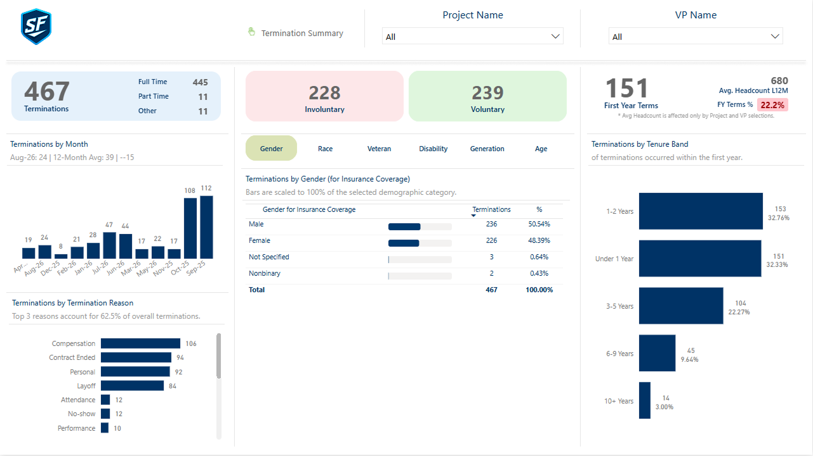
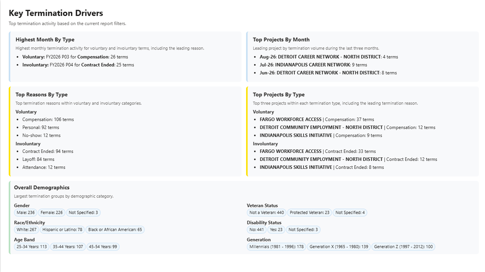
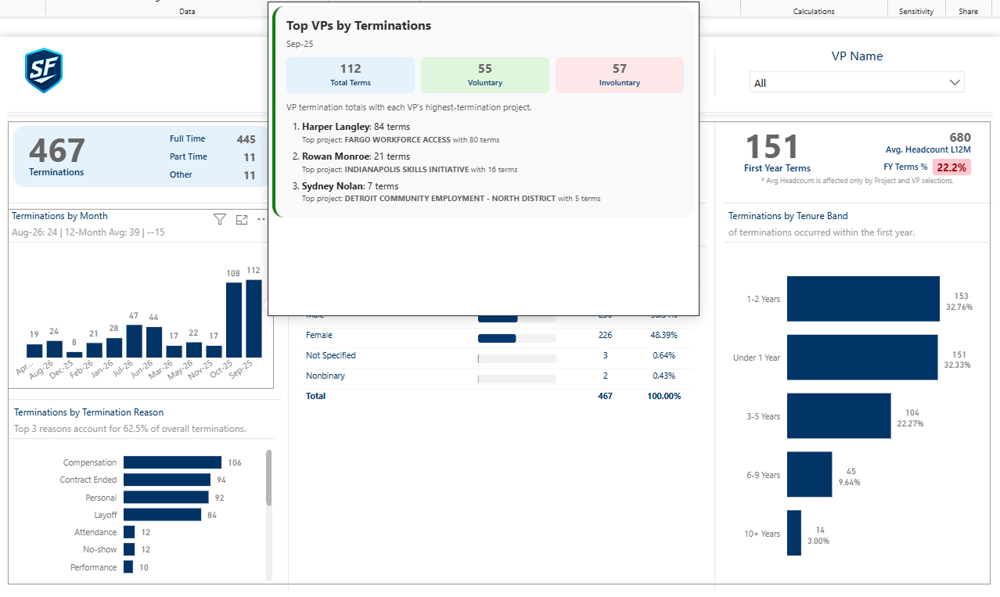
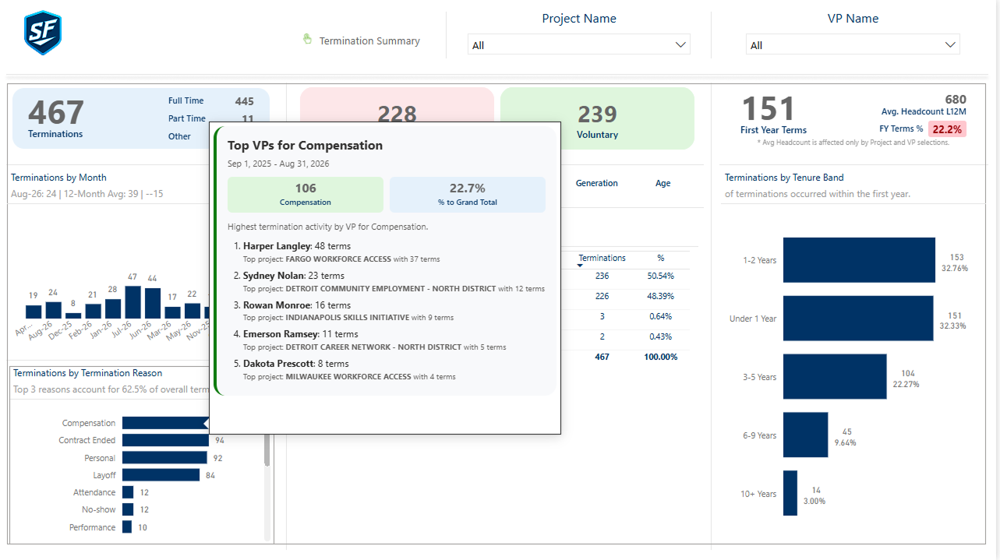

# Termination Report Sample

> ⚠️ This project uses sample data and is intended for demonstration and learning purposes only.

## Overview

This Power BI sample demonstrates how employee terminations, termination reasons, tenure, and workforce demographics can be modeled and analyzed using a modern semantic model. The report gives leadership a clear view of who is leaving, when, why, and from where, with drill-through tooltips and an automated summary of the key drivers behind the numbers.

## Files in this folder

| File | Description |
| --- | --- |
| `Termination-Report-Sample.pbip` | Power BI project file |
| `Termination-Report-Sample.Report` | Report pages and visual definitions |
| `Termination-Report-Sample.SemanticModel` | Semantic model, measures, and relationships |
| `Termination-Report-Sample-Data.xlsx` | Sample source data |

## Key Features

- Termination summary with total terminations and Full Time / Part Time / Other breakdown
- Voluntary vs. involuntary termination tracking
- Monthly termination trend with a 12-month average comparison
- Termination reason analysis, including the share of terminations driven by the top reasons
- Demographic analysis by gender, race, veteran status, disability status, generation, and age band
- First-year termination tracking, including FY Terms % against average headcount for the last 12 months
- Tenure band analysis, from under 1 year to 10+ years
- Project Name and VP Name slicers to filter the entire report
- Tooltip pages showing Top VPs by terminations for a selected month or termination reason
- Key Termination Drivers page with dynamic, filter-aware summaries of the highest months, top projects, top reasons, and largest demographic groups

## Preview

